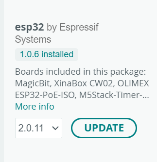

# Tugas 1

## Code 🧑‍💻
code dapat didownload pada link 👇
https://drive.google.com/drive/folders/1_vqxHbDrGwaa13RCV7RrqG2klC556Zd3?usp=sharing

## how to run the code 🤔
* pengaturan Pengaturan File - Preferences:
  * **Copy** file json ini 👇 
  **https://dl.espressif.com/dl/package_esp32_index.json**
    Lalu, **paste di file-preference**
  
  *Install ESP32 di Board Manager. pilih ESP32 seperti gambar 👇
    
  
* Buka file code yang telah di upload
* Pilih board 👉 esp32 -> DOIT ESP32 DEVKIT V1 
* Klik upload untuk menjalankan code 

## Catatan tambahan 📝
kami masih error ketika menjalankan tugas 1 ini