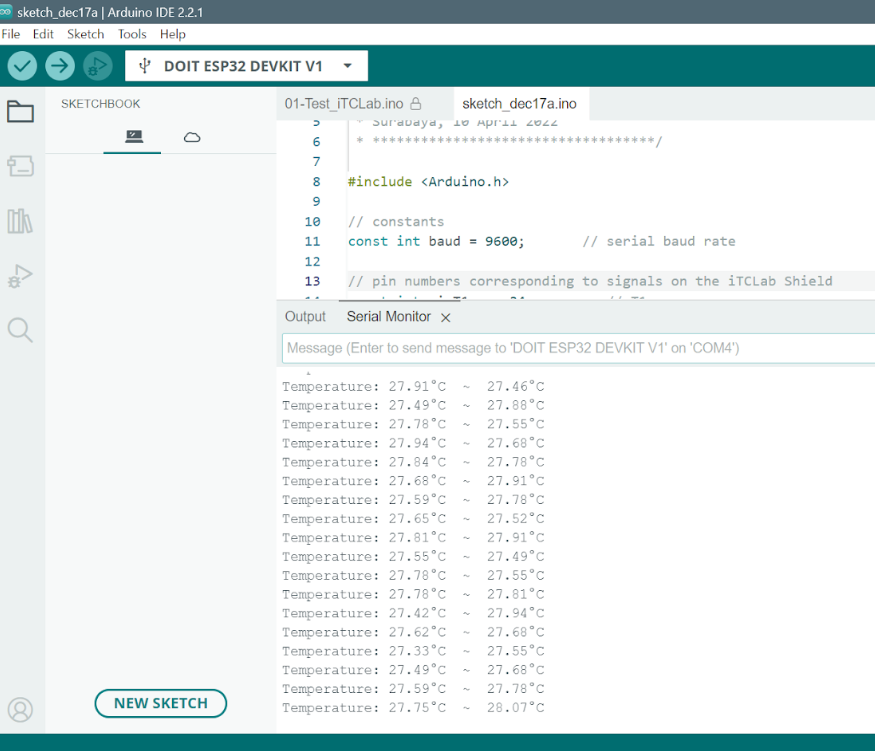

# Tugas 2

## Code 🧑‍💻
code dapat didownload pada link 👇
* https://drive.google.com/drive/folders/18AwONR7YzqzHGH3rHPNRau_PY2Po4CW0?usp=sharing

## how to run the code 🤔
1. pengaturan Pengaturan File - Preferences:
  * **Copy** file json ini 👇 
    - **https://dl.espressif.com/dl/package_esp32_index.json**
    Lalu, **paste di file-preference**
  
  *Install ESP32 di Board Manager. pilih ESP32 seperti gambar 👇
    - 
  
2. Buka file code yang telah di upload
3. Pilih board 👉 esp32 -> DOIT ESP32 DEVKIT V1 
4. Klik upload untuk menjalankan code 

## Output 📤
- 

## Catatan tambahan 📝
-