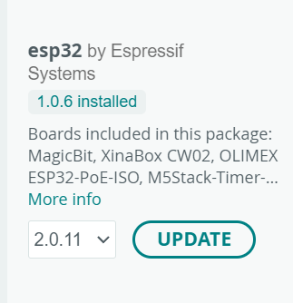
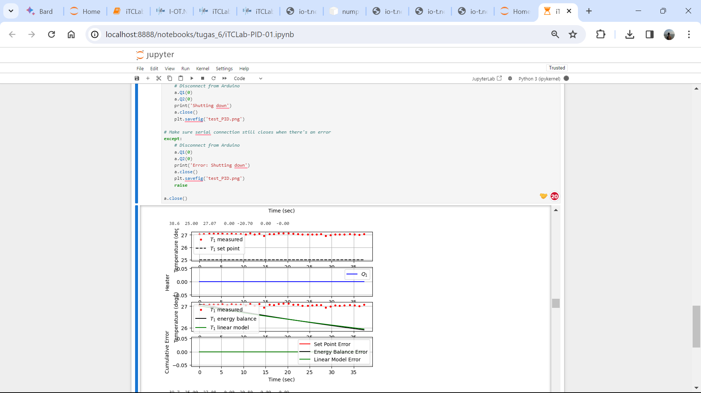

# Tugas 6

## Code 🧑‍💻
ada beberapa code yang perlu didownload dan dijalankan untuk menyelesaikan tugas ke-6. berikut linknya 👇
1. program **kit iTCLab** : https://drive.google.com/file/d/1o0ify9mXAXT4vIHjFLjg1o5uwspf9FcX/view?usp=sharing
2. **modul** : https://drive.google.com/file/d/1VqQ24XNPZPphBfuZGKFgXNk29ilJoOJR/view?usp=sharing
3. program **pengujian Kit iTCLab menggunakan Python Jupyter Notebook** : https://drive.google.com/file/d/1Q2soE9iTPJVBPgDJuU7CQXdSqJskw4sw/view?usp=sharing

## how to run the code 🤔
1. pengaturan Pengaturan File - Preferences:
  * **Copy** file json ini 👇 
    - **https://dl.espressif.com/dl/package_esp32_index.json**
    Lalu, **paste di file-preference**
  
  *Install ESP32 di Board Manager. pilih ESP32 seperti gambar 👇
    - 
  
2. Buka file code yang telah di upload
3. Pilih board 👉 esp32 -> DOIT ESP32 DEVKIT V1 
4. jalankan **kit iTCLab** di arduino IDE
5. buka jupiter notbook
6. letakkan **program modul** di root direktori yang sama dengan program **pengujian Kit iTCLab menggunakan Python Jupyter Notebook**
7. jalankan program **pengujian Kit iTCLab menggunakan Python Jupyter Notebook**

## Output 📤
- 

## Catatan tambahan 📝
-