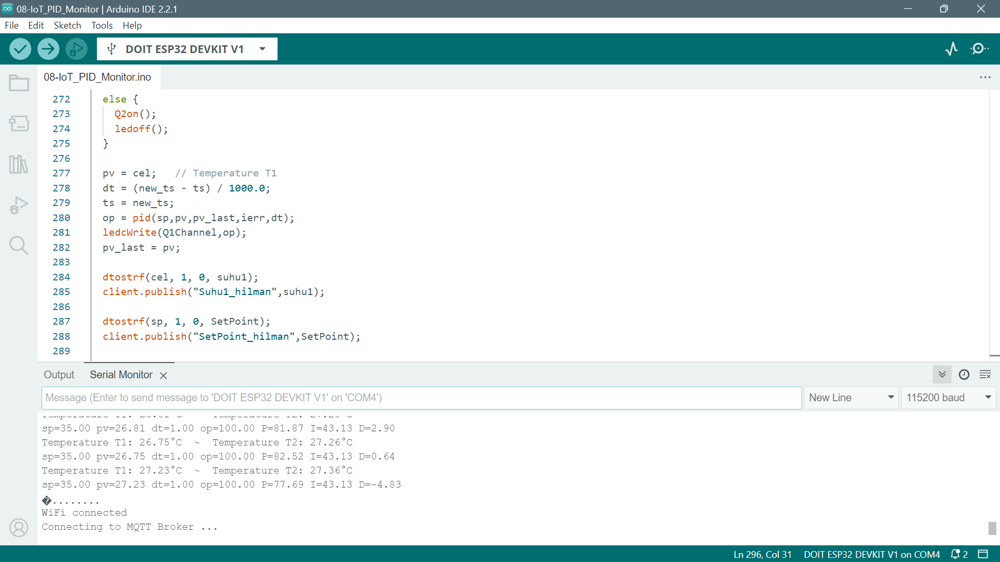

# Tugas 8

## Code 🧑‍💻
code dapat didownload pada link 👇
* https://drive.google.com/file/d/1dVnsgZYMOwB-SAF4nu7leHwridPhX7KQ/view?usp=sharing

## how to run the code 🤔
1. pengaturan Pengaturan File - Preferences:
  * **Copy** file json ini 👇 
    - **https://dl.espressif.com/dl/package_esp32_index.json**
    Lalu, **paste di file-preference**
  
  * Install ESP32 di Board Manager. pilih ESP32 seperti gambar 👇
    - 
  
2. Pilih board 👉 esp32 -> DOIT ESP32 DEVKIT V1 
3. jalankan **Code** yang telah di download di arduino IDE

## Output 📤
- 

## Catatan tambahan 📝
-